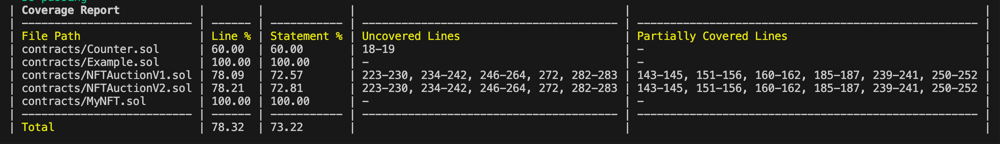
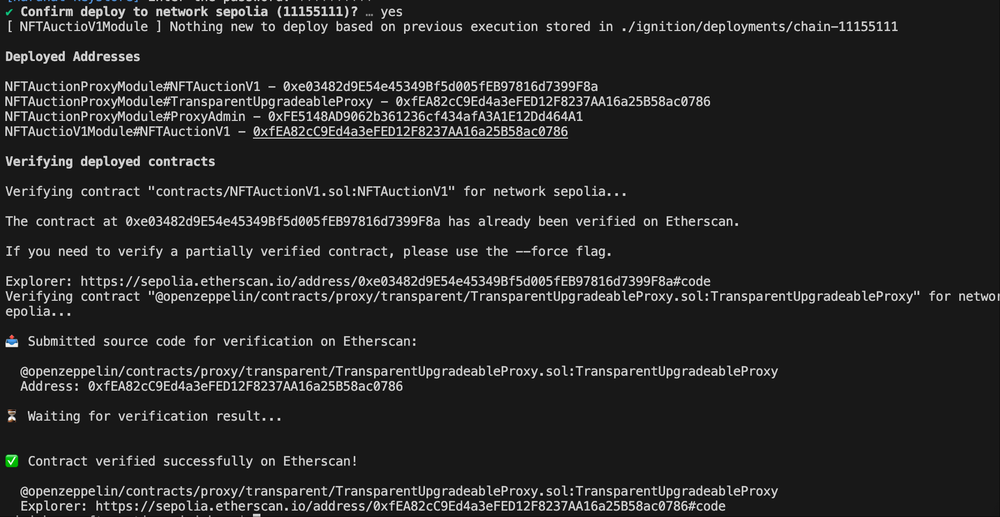
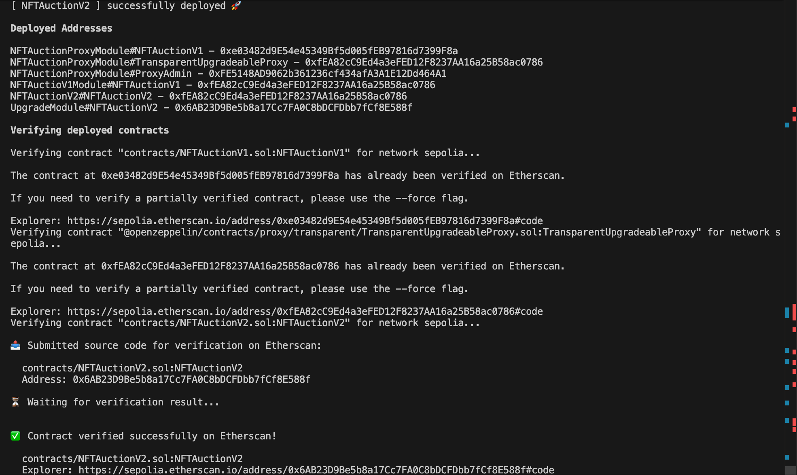

# Sample Hardhat 3 Beta Project (`node:test` and `viem`)

## 单元测试

```shell
npx hardhat test solidity
```

### 单元测试覆盖率
```shell
npx hardhat test solidity --coverage
```



## 在Sepolia网上部署&升级

### 部署

```shell
npx hardhat ignition deploy ignition/modules/NFTAuctionProxyModule.ts --network sepolia --verify
```



### 升级

```shell
npx hardhat ignition deploy ignition/modules/NFTAuctionUpgradeModule.ts --network sepolia --verify
```



### 部署合约地址参考`igniton/deployments/chain-11155111/deployed_addresses.json`


